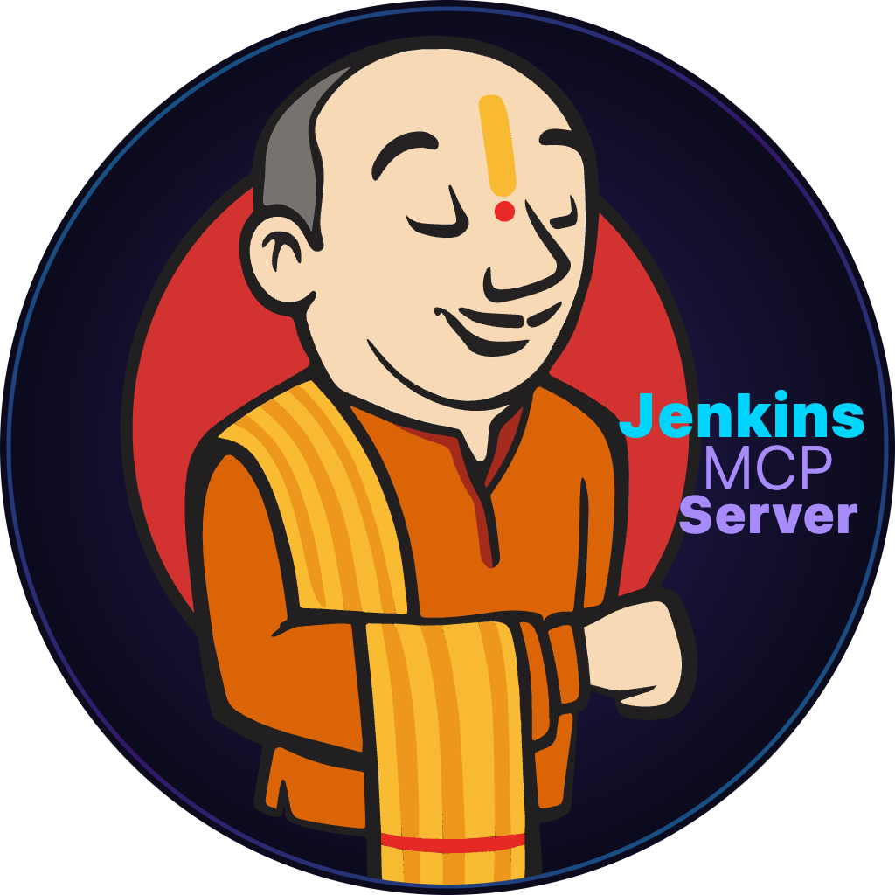

<p align="center">
  
</p>

<h1 align="center">Jenkins MCP Server</h1>

<p align="center">
  <a href="https://github.com/bhayanak/jenkins-mcp-server/actions"></a>
  <a href="https://www.npmjs.com/package/jenkins-mcp-server"></a>
  <a href="LICENSE"></a>
  
</p>

<p align="center">
  A <strong>Model Context Protocol (MCP) server</strong> that lets AI assistants manage Jenkins CI/CD pipelines — list jobs, trigger builds, inspect logs, monitor nodes, and more.
</p>

---

## Packages

| Package | Description |
|---------|-------------|
| [jenkins-mcp-server](packages/jenkins-mcp-server/README.md) | MCP server wrapping the Jenkins REST API — 14 tools for jobs, builds, logs, nodes, queue, and plugins |
| [jenkins-mcp-vscode-extension](packages/jenkins-mcp-vscode-extension/README.md) | VS Code extension that registers the MCP server for Copilot/AI chat with start/stop/output controls |

## Quick Start

### Use the VS Code Extension

1. Install the extension from `VSCODE Studio Marketplace`
2. Open VS Code Settings and configure:
   - `jenkins-mcp.jenkinsUrl` — your Jenkins URL
   - `jenkins-mcp.jenkinsUser` — your username
   - `jenkins-mcp.jenkinsToken` — your API token
3. The server appears in **MCP Servers** list automatically
4. Start using Jenkins tools in Copilot Chat

### Use Standalone

```bash
export JENKINS_MCP_URL=https://ci.example.com
export JENKINS_MCP_USER=admin
export JENKINS_MCP_TOKEN=your-api-token
npx jenkins-mcp-server
```


## Tools Available

The server exposes **14 MCP tools**:

| Tool | Description |
|------|-------------|
| `jenkins_list_jobs` | List jobs with status and health |
| `jenkins_get_job_config` | Get job XML configuration |
| `jenkins_create_job` | Create job from XML config |
| `jenkins_toggle_job` | Enable/disable a job |
| `jenkins_trigger_build` | Trigger a build |
| `jenkins_get_build` | Get build details |
| `jenkins_abort_build` | Abort a running build |
| `jenkins_list_builds` | List recent builds |
| `jenkins_get_build_log` | Get console output |
| `jenkins_search_logs` | Search logs with regex |
| `jenkins_list_nodes` | List agents/nodes |
| `jenkins_toggle_node` | Take node online/offline |
| `jenkins_list_queue` | View build queue |
| `jenkins_list_plugins` | List installed plugins |

## License

[MIT](LICENSE)
